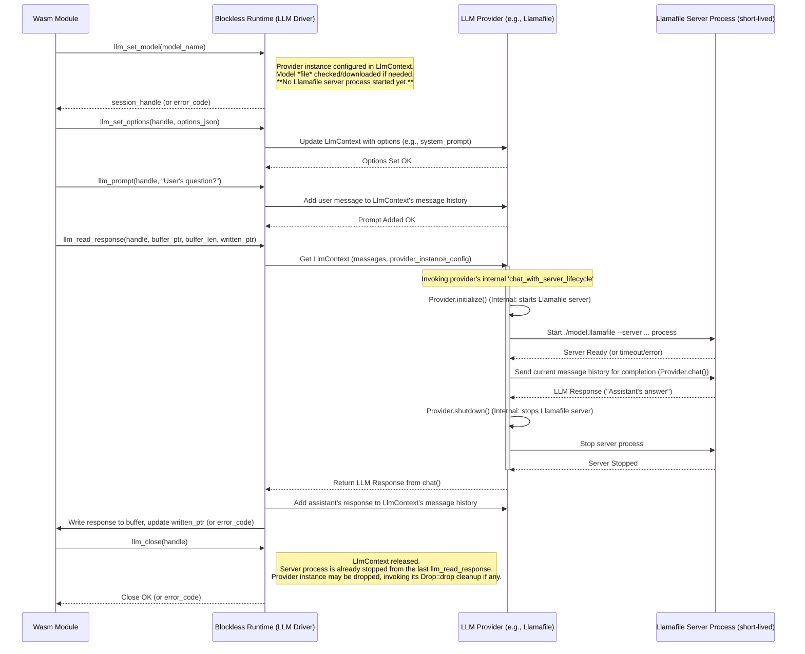
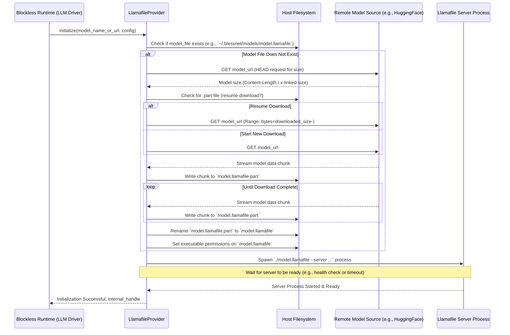
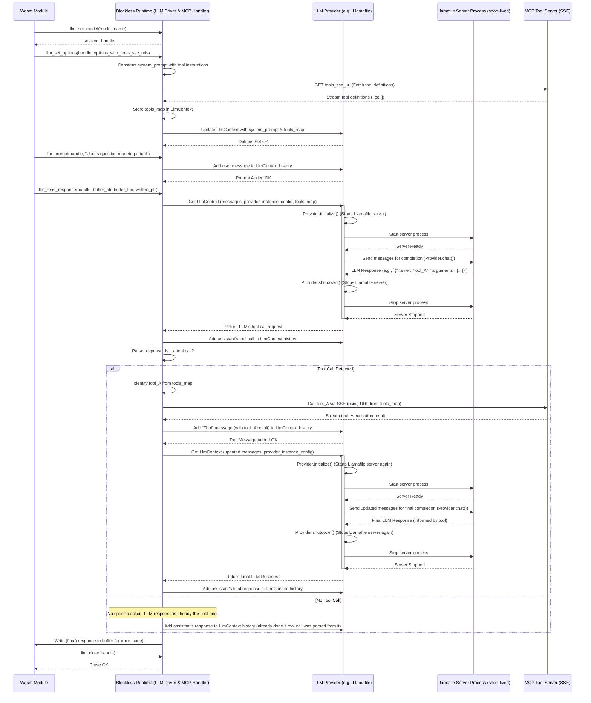

# Blockless LLM Module Developer Documentation

The Blockless LLM (Large Language Model) module provides an interface for WebAssembly (Wasm) modules to interact with various LLMs.
It allows Wasm applications to leverage powerful AI capabilities like text generation, chat, and tool usage through a standardized API.

## Overview

The LLM module acts as a bridge between Wasm code and LLM providers.
The primary supported provider currently is [`llamafile`](https://github.com/Mozilla-Ocho/llamafile), which allows running compatible LLM models locally.

The module handles:

1. **Model Management**: Setting up and managing different LLM models. For `llamafile`, this includes downloading the model if it's not present and starting the `llamafile` server.
2. **Session Management**: Each interaction with an LLM is managed through a `handle`, allowing multiple concurrent sessions or different model configurations.
3. **Prompting and Response Handling**: Sending prompts to the LLM and retrieving its responses.
4. **Option Configuration**: Setting parameters like `system_message`, `temperature`, `top_p` and `tools_sse_urls` - for MCP support.
  - Currently only SSE (server-sent events) URLs are supported for MCP; command-based tool calls are not supported (yet).
5. **Tool Usage (via MCP)**: Enabling LLMs to use external tools through the Model Context Protocol (MCP). The LLM can indicate a function call, which the host (Blockless runtime) can intercept, execute, and feed the results back to the LLM.

## Core Concepts

* **LLM Handle (`handle: u32`)**: A unique identifier returned when you set an LLM model. All subsequent operations (setting options, prompting, getting responses, closing) for that specific model instance require this handle.
* **Models (`model: &str`)**: A string identifying the LLM to use.
  * For predefined `llamafile` models, you can use short names like `"Llama-3.2-1B-Instruct"`.
  * You can also provide a direct URL to a `.llamafile` (e.g., `"https://huggingface.co/Mozilla/Llama-3.2-1B-Instruct-llamafile/resolve/main/Llama-3.2-1B-Instruct.Q6_K.llamafile"`).
  * The runtime will attempt to download the model to `~/.blessnet/models/` if it's not already present and make it executable.
* **LLM Options (`options: LlmOptions`)**: A JSON string that configures the behavior of the LLM session.
  * `system_message: Option<String>`: A system prompt to guide the LLM's behavior.
  * `tools_sse_urls: Option<Vec<String>>`: An array of URLs pointing to MCP (Model Context Protocol) Server-Sent Events (SSE) endpoints for tool definitions.
  * `temperature: Option<f32>`: Controls randomness in generation (e.g., 0.7).
  * `top_p: Option<f32>`: Nucleus sampling parameter (e.g., 0.9).
  * NOTE: The `temperature` and `top_p` options are unused at the moment.
* **LLM Provider**: An abstraction for different LLM backends. Currently, `LlamafileProvider` is the primary implementation. It manages the lifecycle of a `llamafile` process.
* **Messages**: Interactions are structured as a sequence of messages with roles:
    * `System`: Initial instructions for the LLM - sets initial context
    * `User`: Input from the user/Wasm module.
    * `Assistant`: Output from the LLM.
    * `Tool`: Output from an executed tool, fed back to the LLM.
* **Model Context Protocol (MCP)**: If `tools_sse_urls` are provided, the LLM module can fetch tool definitions. The system prompt is augmented to instruct the LLM on how to request a tool call (typically by outputting a specific JSON structure).
The host intercepts this, executes the tool via MCP, and then feeds the tool's output back into the LLM conversation for a final response.

## Basic LLM Interaction Flow

This diagram shows the typical sequence, emphasizing that the Llamafile server process is started and stopped for each chat completion request (`llm_read_response` call).



## `llamafile` Model Download and Server Initialization Flow

This diagram details the internal steps taken by the `LlamafileProvider` when `llm_set_model` is called and the model is not yet available or the server is not running:



## MCP Support

The following diagram shows the sequence of events when `tools_sse_urls` are provided allowing the LLM to use MCP-enabled tools:



## Wasm API (WITX Interface)

The LLM module exposes the following functions to Wasm modules, typically under the import module name `blockless_llm` (or as defined by the specific SDK).
Memory for string parameters and output buffers must be allocated within the Wasm module, and pointers/lengths are passed to these host functions.

All functions return an `LlmErrorKind` code (`u32`). `0` indicates success.

---

**1. `llm_set_model(model_ptr: i32, model_len: i32) -> u32`**

Initializes an LLM session with the specified model. If the model is not available locally, it may be downloaded.

* `model_ptr: i32`: Pointer to the UTF-8 encoded string in Wasm memory specifying the model name or URL.
* `model_len: i32`: Length of the model string.
* **Returns**: A `u32` handle for the LLM session if successful, otherwise an `LlmErrorKind` code.

**Error Codes (Non-Zero on Failure):**
* `LlmErrorKind::ModelNotSupported`
* `LlmErrorKind::ModelInitializationFailed`

---

**2. `llm_get_model(handle: u32, model_buf_ptr: i32, model_buf_len: i32, written_ptr: i32) -> u32`**

Retrieves the model name associated with the given handle.

* `handle: u32`: The LLM session handle.
* `model_buf_ptr: i32`: Pointer to a buffer in Wasm memory to write the model name.
* `model_buf_len: i32`: The capacity of the `model_buf_ptr`.
* `written_ptr: i32`: Pointer to an `i32` in Wasm memory where the actual number of bytes written to `model_buf_ptr` will be stored.
* **Returns**: `LlmErrorKind` code (`0` for success).

**Error Codes:**
* `LlmErrorKind::ModelNotSet`
* `LlmErrorKind::Utf8Error` (if model name can't be encoded)
* (Implicit) Buffer too small if `model_buf_len` is insufficient.

---

**3. `llm_set_options(handle: u32, opts_ptr: i32, opts_len: i32) -> u32`**

Sets options for the LLM session. This will clear previous conversation history and apply a new system prompt.

* `handle: u32`: The LLM session handle.
* `opts_ptr: i32`: Pointer to the UTF-8 encoded JSON string in Wasm memory containing `LlmOptions`.
* `opts_len: i32`: Length of the options JSON string.
* **Returns**: `LlmErrorKind` code (`0` for success).

**Example `LlmOptions` JSON:**
```json
{
    "system_message": "You are a helpful AI assistant.",
    "tools_sse_urls": ["http://localhost:8080/mcp_tool_sse_endpoint"],
    "temperature": 0.7,
    "top_p": 0.9
}
```

**Error Codes:**
* `LlmErrorKind::ModelNotSet`
* `LlmErrorKind::ModelOptionsNotSet` (if JSON parsing fails)

---

**4. `llm_get_options(handle: u32, opts_buf_ptr: i32, opts_buf_len: i32, written_ptr: i32) -> u32`**

Retrieves the current `LlmOptions` JSON string for the session.

*  `handle: u32`: The LLM session handle.
*  `opts_buf_ptr: i32`: Pointer to a buffer in Wasm memory to write the options JSON.
*  `opts_buf_len: i32`: The capacity of `opts_buf_ptr`.
*  `written_ptr: i32`: Pointer to an `i32` in Wasm memory where the actual number of bytes written to `opts_buf_ptr` will be stored.
* **Returns**: `LlmErrorKind` code (`0` for success).

**Error Codes:**
*  `LlmErrorKind::ModelNotSet`
*  `LlmErrorKind::ModelOptionsNotSet` (if options can't be serialized)

---

**5. `llm_prompt(handle: u32, prompt_ptr: i32, prompt_len: i32) -> u32`**

Sends a user prompt to the LLM. This adds the prompt to the conversation history.

* `handle: u32`: The LLM session handle.
* `prompt_ptr: i32`: Pointer to the UTF-8 encoded prompt string in Wasm memory.
* `prompt_len: i32`: Length of the prompt string.
* **Returns**: `LlmErrorKind` code (`0` for success).

**Error Codes:**
* `LlmErrorKind::ModelNotSet`
* `LlmErrorKind::Utf8Error` (if prompt is invalid UTF-8)

---

**6. `llm_read_response(handle: u32, resp_buf_ptr: i32, resp_buf_len: i32, written_ptr: i32) -> u32`**

Reads the LLM's response to the last prompt (or series of prompts/tool calls).

* `handle: u32`: The LLM session handle.
* `resp_buf_ptr: i32`: Pointer to a buffer in Wasm memory to write the LLM response.
* `resp_buf_len: i32`: The capacity of `resp_buf_ptr`.
* `written_ptr: i32`: Pointer to an `i32` in Wasm memory where the actual number of bytes written to `resp_buf_ptr` will be stored.
* **Returns**: `LlmErrorKind` code (`0` for success). If the response is larger than `resp_buf_len`, the response will be truncated.

**Error Codes:**
* `LlmErrorKind::ModelNotSet`
* `LlmErrorKind::ModelCompletionFailed`
* `LlmErrorKind::Utf8Error`
* `LlmErrorKind::MCPFunctionCallError`

---

**7. `llm_close(handle: u32) -> u32`**

Closes the LLM session and releases associated resources. For `LlamafileProvider`, this shuts down the corresponding `llamafile` server process if it was started by this session.

* `handle: u32`: The LLM session handle.
* **Returns**: `LlmErrorKind` code (`0` for success).

**Error Codes:**
* `LlmErrorKind::ModelShutdownFailed`

## Workflow Summary from Wasm

A typical interaction flow from a Wasm module:

1. **Allocate Memory**: Allocate memory in Wasm for model name, options JSON, prompts, and response buffers.
2. **Set Model**: Call `llm_set_model()` with the model name/URL. Store the returned handle. Check for errors.
3. **Set Options (Optional)**:
* Prepare `LlmOptions` as a JSON string in Wasm memory.
* Call `llm_set_options()` with the handle and options. Check for errors.
4. **Prompt**:
* Prepare your prompt string in Wasm memory.
* Call `llm_prompt()` with the handle and prompt. Check for errors.
5. **Read Response**:
* Call `llm_read_response()` with the handle and a buffer to receive the response. Check for errors.
* The number of bytes written to your buffer will be in the `written_ptr`.
* Process the response from your buffer.
6. **Repeat (Prompt/Read Response)**: You can continue the conversation by sending more prompts and reading responses. The context is maintained.
7. **Close Session**: When done, call `llm_close()` with the handle to free resources.

**Memory Management Note for Wasm Developers:**

When passing strings (model name, options, prompt) to the host, you allocate memory in Wasm, write the string, and pass the pointer and length.
When receiving strings (get model, get options, read response), you allocate a buffer in Wasm, pass its pointer and capacity, and the host writes into it.
The host also writes the actual number of bytes written into your `written_ptr`.
On the SDK's we allocate a specific max size for the response buffer, so you don't need to provide a buffer length.

## Error Handling

All LLM module functions return a `u32` status code. `0` indicates success. Non-zero values correspond to `LlmErrorKind`:

| Code | Enum Member                 | Description                                  |
| :--- | :-------------------------- | :------------------------------------------- |
| 1    | `ModelNotSet`               | LLM model hasn't been set for the handle.    |
| 2    | `ModelNotSupported`         | The specified model is not supported.        |
| 3    | `ModelInitializationFailed` | Failed to initialize the model/provider.     |
| 4    | `ModelCompletionFailed`     | LLM failed to generate a response.           |
| 5    | `ModelOptionsNotSet`        | Options are invalid or not set.              |
| 6    | `ModelShutdownFailed`       | Failed to shut down the model/provider.      |
| 7    | `Utf8Error`                 | String encoding/decoding error.              |
| 8    | `RuntimeError`              | General runtime error within the LLM driver. |
| 9    | `MCPFunctionCallError`      | Error during MCP tool execution.             |

## Rust SDK

The Rust SDK is available here: https://github.com/blocklessnetwork/sdk-rust
With examples on LLM module/plugin usage:
- LLM: https://github.com/blocklessnetwork/sdk-rust/blob/main/examples/llm.rs
- LLM with MCP: https://github.com/blocklessnetwork/sdk-rust/blob/main/examples/llm-mcp.rs
