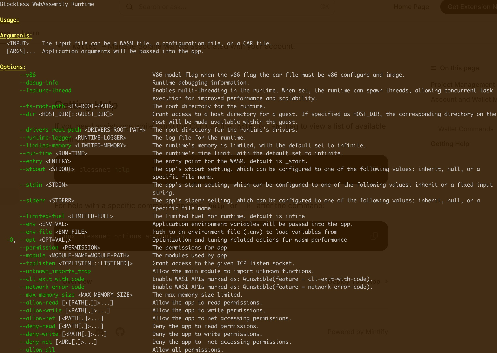
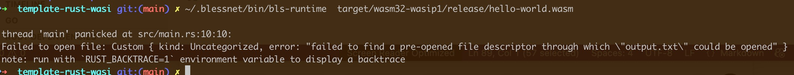
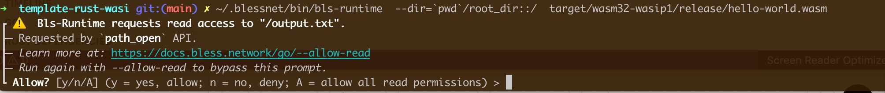

# How to Use `bls-runtime`

## Install binary

1. Clone the repository and build the runtime using Cargo

```bash
git clone https://github.com/blocklessnetwork/bls-runtime.git
cd bls-runtime
cargo build --release
```
This will generate the bls-runtime binary in the target/release/ directory.

2. Download binary release from the repository

```bash
sh -c "curl https://raw.githubusercontent.com/blessnetwork/bls-runtime/refs/heads/main/install.sh | bash"
```
**Note: Please select the appropriate version based on your operating system and CPU architecture.**

Try to execute binary

```bash
./bls-runtime --help
```



## How to build the wasm

### Download the bls-javy

```bash
sh -c "curl https://raw.githubusercontent.com/blocklessnetwork/bls-javy/main/download.sh | bash"
```

### Write and execute hello world

Save code to the hello.js file
```javascript
function helloWorld() {
    console.log("hello World")
}
helloWorld()
```

Build the code to wasm

```bash
bls-javy build hello.js -o hello.wasm
```

Run the wasm with runtime

```bash
bls-runtime  hello.wasm
```

### Use --limited-fuel

Use option `--limited-fuel` to limit the instructions the app can execute.

```bash
bls-runtime --limited-fuel=1000  hello.wasm
```

After excute the wasm, you will get the `1` as the app execute code, and in the log file `hello.log` you will get the message "[2025-05-09T03:23:32Z ERROR blockless] All fuel is consumed, the app exited, fuel consumed 0, Max Fuel is 1000."

### Use --dir or --fs-root-path

The runtime is a great sandbox — by default, it cannot access the local file system unless explicitly configured. To enable local file system access, you need to map it using the `--fs-root-path` and `--dir` options.

use follow command to build wasm file

```bash
git clone https://github.com/blocklessnetwork/template-rust-wasi.git
cd template-rust-wasi
cargo build --target wasm32-wasip1 --release
```

then mkdir root directory as the file system
```bash
mkdir root_dir
```

If you don't map the required path, running the WASM app will result in a crash.

```
bls-runtime target/wasm32-wasip1/release/hello-world.wasm
```



The correct approach is to run the following command.

```
bls-runtime --dir=`pwd`/root_dir::/ target/wasm32-wasip1/release/hello-world.wasm
```
```--dir=`pwd`/root_dir::/``` mean map host dir `pwd`/root_dir to / 




### Use --max-memory-size

Set the runtime memory limits to restrict the app's maximum memory usage. By default, there are no limits.

```
git clone -b memory_limited https://github.com/blocklessnetwork/template-rust-wasi.git
cd template-rust-wasi
cargo build --target wasm32-wasip1 --release
bls-runtime --max-memory-size=1024 target/wasm32-wasip1/release/hello-world.wasm
```


