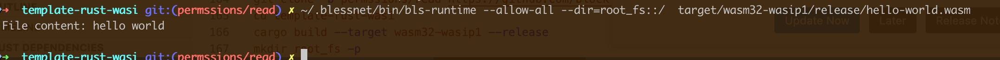
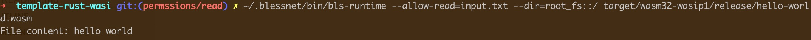

# How to Use `bls-runtime`

## Install binary

1. Clone the repository and build the runtime using Cargo

```bash
git clone https://github.com/blocklessnetwork/bls-runtime.git
cd bls-runtime
cargo build --release
```
This will generate the bls-runtime binary in the target/release/ directory.

2. Download binary release from the repository

```bash
sh -c "curl https://raw.githubusercontent.com/blessnetwork/bls-runtime/refs/heads/main/install.sh | bash"
```
**Note: Please select the appropriate version based on your operating system and CPU architecture.**

Try to execute binary

```bash
bls-runtime --help
```

```
Blockless WebAssembly Runtime

Usage:

Arguments:
  <INPUT>    The input file can be a WASM file, a configuration file, or a CAR file.
  [ARGS]...  Application arguments will be passed into the app.

Options:
      --v86                                    V86 model flag when the v86 flag the car file must be v86 configure and image.
      --debug-info                             Runtime debugging information.
      --feature-thread                         Enables multi-threading in the runtime. When set, the runtime can spawn threads, allowing concurrent task
                                               execution for improved performance and scalability.
      --fs-root-path <FS-ROOT-PATH>            The root directory for the runtime.
      --dir <HOST_DIR[::GUEST_DIR]>            Grant access to a host directory for a guest. If specified as HOST_DIR, the corresponding directory on the
                                               host will be made available within the guest.
      --drivers-root-path <DRIVERS-ROOT-PATH>  The root directory for the runtime's drivers.
      --runtime-logger <RUNTIME-LOGGER>        The log file for the runtime.
      --limited-memory <LIMITED-MEMORY>        The runtime's memory is limited, with the default set to infinite.
      --run-time <RUN-TIME>                    The runtime's time limit, with the default set to infinite.
      --entry <ENTERY>                         The entry point for the WASM, default is _start.
      --stdout <STDOUT>                        The app's stdout setting, which can be configured to one of the following values: inherit, null, or a
                                               specific file name.
      --stdin <STDIN>                          The app's stdin setting, which can be configured to one of the following values: inherit or a fixed input
                                               string.
      --stderr <STDERR>                        The app's stderr setting, which can be configured to one of the following values: inherit, null, or a
                                               specific file name
      --limited-fuel <LIMITED-FUEL>            The limited fuel for runtime, default is infine
      --env <ENV=VAL>                          Application environment variables will be passed into the app.
      --env-file <ENV_FILE>                    Path to an environment file (.env) to load variables from
  -O, --opt <OPT=VAL,>                         Optimization and tuning related options for wasm performance
      --permission <PERMISSION>                The permissions for app
      --module <MODULE-NAME=MODULE-PATH>       The modules used by app
      --tcplisten <TCPLISTEN[::LISTENFD]>      Grant access to the given TCP listen socket.
      --unknown_imports_trap                   Allow the main module to import unknown functions.
      --cli_exit_with_code                     Enable WASI APIs marked as: @unstable(feature = cli-exit-with-code).
      --network_error_code                     Enable WASI APIs marked as: @unstable(feature = network-error-code).
      --max_memory_size <MAX_MEMORY_SIZE>      The max memory size limited.
      --allow-read [<[PATH[,]]>...]            Allow the app to read permissions.
      --allow-write [<PATH[,]>...]             Allow the app to write permissions.
      --allow-net [<PATH[,]>...]               Allow the app to net accessing permissions.
      --deny-read [<PATH[,]>...]               Deny the app to read permissions.
      --deny-write [<PATH[,]>...]              Deny the app to write permissions.
      --deny-net [<URL[,]>...]                 Deny the app to  net accessing permissions.
      --allow-all                              Allow all permissions.
      --nn                                     Enable support for WASI neural network imports .
      --nn-graph <NN_GRAPH>                    Pre-load machine learning graphs (i.e., models) for use by wasi-nn.  Each use of the flag will preload a
                                               ML model from the host directory using the given model encoding
  -h, --help                                   Print help
  -V, --version                                Print version
```

## How to build the wasm

### Download the bls-javy

```bash
sh -c "curl https://raw.githubusercontent.com/blocklessnetwork/bls-javy/main/download.sh | bash"
```

### Write and execute hello world

Save code to the hello.js file
```javascript
function helloWorld() {
    console.log("hello World")
}
helloWorld()
```

Build the code to wasm

```bash
bls-javy build hello.js -o hello.wasm
```

Run the wasm with runtime

```bash
bls-runtime  hello.wasm
```

### Use `--limited-fuel` option

Use option `--limited-fuel` to limit the instructions the app can execute.

```bash
bls-runtime --limited-fuel=1000  hello.wasm
```

After excute the wasm, you will get the `1` as the app execute code, and in the log file `hello.log` you will get the message "[2025-05-09T03:23:32Z ERROR blockless] All fuel is consumed, the app exited, fuel consumed 0, Max Fuel is 1000."

### Use `--dir` or `--fs-root-path` option

The runtime is a great sandbox — by default, it cannot access the local file system unless explicitly configured. To enable local file system access, you need to map it using the `--fs-root-path` and `--dir` options.

use follow command to build wasm file

```bash
git clone https://github.com/blocklessnetwork/template-rust-wasi.git
cd template-rust-wasi
cargo build --target wasm32-wasip1 --release
```

then mkdir root directory as the file system
```bash
mkdir root_dir
```

If you don't map the required path, running the WASM app will result in a crash.

```bash
bls-runtime target/wasm32-wasip1/release/hello-world.wasm
```
```
thread 'main' panicked at src/main.rs:10:10:
Failed to open file: Custom { kind: Uncategorized, error: "failed to find a pre-opened file descriptor through which \"output.txt\" could be opened" }
note: run with `RUST_BACKTRACE=1` environment variable to display a backtrace
```


The correct approach is to run the following command.

```bash
bls-runtime --dir=`pwd`/root_dir::/ target/wasm32-wasip1/release/hello-world.wasm
```
```--dir=`pwd`/root_dir::/``` mean map host dir `pwd`/root_dir to / 


### Use `--max-memory-size` option 

Set the runtime memory limits to restrict the app's maximum memory usage. By default, there are no limits.

```
git clone -b memory_limited https://github.com/blocklessnetwork/template-rust-wasi.git
cd template-rust-wasi
cargo build --target wasm32-wasip1 --release
bls-runtime --max-memory-size=1024 target/wasm32-wasip1/release/hello-world.wasm
```


### Use `--env` option

In some scenarios, we use environment variables within a WASM app. By default, no environment variables are available, but they can be passed in using the `--env` option.


```bash
git clone -b environment https://github.com/blocklessnetwork/template-rust-wasi.git
cd template-rust-wasi
cargo build --target wasm32-wasip1 --release
bls-runtime --env=LANG=en_AU.UTF-8 --env=HOME=/home/ target/wasm32-wasip1/release/hello-world.wasm
```


### The permssion options
The runtime access to most system I/O is denied by default. If there are some I/O operations that are allowed in a limited capacity, even by default. 
To enable the operations, the user must  grant permission to the bls-runtime. Follow options is valid for security of bls-runtime `--allow-read`, `--allow-write`, `--allow-net`.

When execute the wasm app, use can explicitly grant permission to specify files, directories and network.

Users can also explicitly disallow access to specific resources by using the `--deny-read`, `--deny-write`, `--deny-net` flags

`--allow-all` flag that grants all permissions to wasm app

```bash
git clone -b permssions/read https://github.com/blocklessnetwork/template-rust-wasi.git
cd template-rust-wasi
cargo build --target wasm32-wasip1 --release
mkdir root_fs -p
echo "hello world">root_fs/input.txt

bls-runtime --allow-all --dir=root_fs::/ target/wasm32-wasip1/release/hello-world.wasm
```




#### File system access 

The wasm app can't access read and write arbitrary files on the file system, even you map the host dir to wasm app use option `--dir` This includes listing the contents of directories.

Access to read files is granted using the `--allow-read` option and access to write files is granted using the `--allow-write` option. These flags can be specified with a list of paths to allow access to specific files or directories and any subdirectories in them.

Definition:`--allow-read[=<PATH>...]`

```bash
git clone -b permssions/read https://github.com/blocklessnetwork/template-rust-wasi.git
cd template-rust-wasi
cargo build --target wasm32-wasip1 --release
mkdir root_fs -p
echo "hello world">root_fs/input.txt

# Allow all reads to file system
bls-runtime --allow-read --dir=root_fs::/ target/wasm32-wasip1/release/hello-world.wasm

# Allow all read input.txt output.txt only to file system
bls-runtime --allow-read=input.txt,output.txt --dir=root_fs::/ target/wasm32-wasip1/release/hello-world.wasm
```




Definition:`--allow-write[=<PATH>...]`
```bash
git clone -b permssions/write https://github.com/blocklessnetwork/template-rust-wasi.git
cd template-rust-wasi
cargo build --target wasm32-wasip1 --release
mkdir root_fs -p

# Allow all writes to file system
bls-runtime --allow-write --dir=root_fs::/ target/wasm32-wasip1/release/hello-world.wasm

# Allow  write files to /
bls-runtime --allow-write=/ --dir=root_fs::/ target/wasm32-wasip1/release/hello-world.wasm

cat root_fs/output.txt
```


### Network access
Execute wasm app can not make network requests. Network access is granted using the `--allow-net` option. This option can be specified with a list of IP addresses or hostnames to allow access to specific network addresses.

Definition: `--allow-net[=<IP_OR_HOSTNAME>...]`

Definition:`--allow-net[=<PATH>...]`
```bash
git clone -b permssions/http https://github.com/blocklessnetwork/template-rust-wasi.git
cd template-rust-wasi
cargo build --target wasm32-wasip1 --release
mkdir root_fs -p

# Allow network access
bls-runtime --allow-net --dir=root_fs::/ target/wasm32-wasip1/release/hello-world.wasm

# Allow network access to httpbin.org
bls-runtime --allow-net=httpbin.org target/wasm32-wasip1/release/hello-world.wasm

cat root_fs/output.txt
```

